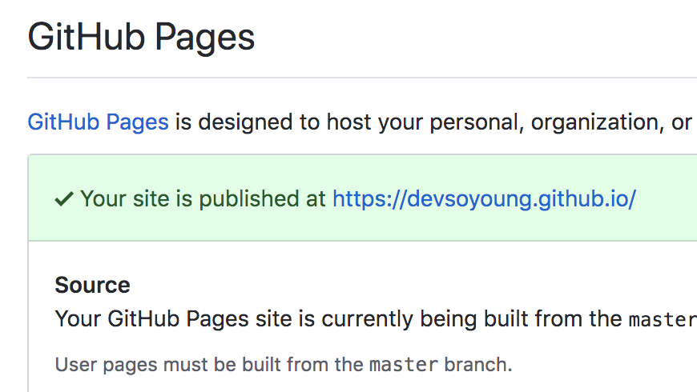

GitHub에서는 GitHub Pages로 호스팅 서비스를 제공하고 있습니다. 제 블로그 또한 저의 GitHub 사용자 사이트인 `devsoyoung.github.io`를 통해 호스팅하고 있습니다. 

오늘 포스트에서는 제가 블로그를 GitHub Pages로 호스팅 하면서 겪었던 **소스코드와 배포파일을 분리해서 관리하는 문제**에 대해서 소개해드리려고 합니다.

> 기나긴 삽질 과정이 앞에 담겨있습니다. 핵심이 필요하신 분들은 [여기](#진짜-해결방법)만 보시면 됩니다.

## GitHub Pages
GitHub는 GitHub Pages라는 무료 호스팅 서비스를 제공하고 있으며, 두 가지 방식이 있습니다.

### 사용자 사이트


GitHub에 `username.github.io` 이름을 가지는 레파지토리를 만들고, 배포하고 싶은 코드를 해당 레파지토리에 올리면 레파지토리 이름과 동일한 주소로 호스팅 할 수 있습니다. 이 User Site는 사용자마다 한 개씩만 제공됩니다.

### 프로젝트 사이트
각 레파지토리에 대한 GitHub Pages 호스팅도 가능합니다. 호스팅 하고 싶은 프로젝트의 **설정** 탭에 들어가서 **GitHub Pages**의 Source에 호스팅 하고 싶은 branch를 선택해주면 됩니다. 


기본으로는 None이 선택되어 있고, None을 선택한 경우에는 따로 호스팅하지 않습니다. 원하는 브랜치를 선택하면 `username.github.io/repo_name` 으로 접근해서 호스팅 된 내용을 확인할 수 있습니다.

## What is a problem?
문제는 배포하고 싶은 코드와 개발하는 코드가 달랐습니다. 처음에 gh-pages에 대해 이해하지 못한 채 블로그 소스코드와 빌드한 결과물(public 디렉토리)을 함께 `devsoyoung.github.io`에 넣으니 해당 주소로 접속했을 때, `README.md`에 적힌 내용을 보여주었습니다.

*'html 파일을 public 디렉토리에서 알아서 못찾나보다. 멍청멍청해.'* 라고 생각하고 레파지토리에 소스코드를 다 지운 채 `public` 폴더에 들어있던 모든 코드를 넣어주었습니다. 그렇게 하니 원하는대로 호스팅 되었지만, **소스코드 관리를 위한 새 레포가 필요**해졌습니다.


그렇게 두 달 가까이 블로그를 운영했습니다. 스타일을 수정하거나 글을 쓰고 나면 기존 사용자 사이트 레포의 내용을 비우고 **새로 빌드한 결과물을 복사**합니다. 그리고 원격 저장소에 push합니다. 소스 코드 변경사항은 별도의 **소스코드 레파지토리에서 관리**합니다.

글도 틈틈히 썼고, 블로그 기능도 추가하고, 스타일도 많이 고쳤는데 작업 할 때마다 너무너무 귀찮아서 **코드는 업데이트 해도 블로그는 업데이트를 안하는 지경**에 이르릅니다. *(어차피 아무도 안볼거 라는 마인드로;)*

## How to solve the problem?
귀찮은 짓을 반복하고 블로그를 내팽겨치지 시작할 때 즈음, 인턴도 끝나고 시간도 널널해서 이 문제를 해결해보기로 마음을 먹습니다. 

`package.json`에 미리 정의되어 있는 deploy script를 실행하고 나면 자꾸 생기는 gh-pages 브랜치가 뭔가 관련이 있지 않을까 하는 생각이 들어 찾아보기로 합니다. 

### gh-pages
gh-pages는 해당 브랜치가 GitHub에 있을 경우 알아서 Page용 브랜치로 간주하고 호스팅을 합니다.

```
$ gh-pages -d public
```

이 커맨드를 실행하면 public 디렉토리에 있는 내용물을 `gh-pages` 브랜치로 커밋하고 원격 저장소에 push까지 합니다. 이걸 이용해서 `gh-pages` 브랜치에 public만 커밋하고, 나머지 소스코드는 master에 계속 유지했습니다.


하지만 아무리 기다려도 `README.md` 파일 외에는 보여주지 않습니다. 멍청멍청, 핵멍청하다고 한참 속으로 욕을 하면서 GitHub Pages 관련 설정을 보던 중, 진짜 멍청한 사람이 누군지 알 수 있었습니다. 



제일 아래에 작은 글씨로 된 줄을 보면 사용자 사이트는 반드시 마스터 브랜치로부터 생성된다고 적혀있습니다. gh-pages를 백날 해봐야 해결이 안되는 문제였던 것입니다..ㅎㅎ

이제서야 드디어 제대로 된 생각으로 master 브랜치는 배포할 파일만 두고, 다른 브랜치에 소스코드를 관리하자는 생각이 듭니다.

## 진짜 해결방법

develop 브랜치를 생성하고, 소스코드를 develop 브랜치를 기준으로 관리합니다. 그리고 develop에서 생성한 빌드 결과물을 master로 저장합니다. 이렇게 하기 위해서는

1. 생성한 빌드 결과물만 master에 저장
2. 개발 기준 브랜치를 develop 브랜치로 변경

하는 과정이 필요합니다. 1번 과정을 위해서 gh-pages를 이용합니다.

```
$ npm install gh-pages --save-dev
```

일단 gh-pages를 다운 받아줍니다.

```
$ gh-pages -b master -d public
```
gh-pages를 이용해 `-b` 옵션으로 master 브랜치를 지정하고, `-d` 옵션으로 커밋할 디렉토리를 선택해줍니다. 이렇게 하면 master 브랜치에는 public 디렉토리에 있던 파일들만 업데이트 됩니다.


이제 GitHub의 사용자 사이트 레파지토리로 가서 Settings의 Branches 탭으로 갑니다. 여기에서 기본 브랜치를 선택할 수 있습니다.

> develop 브랜치를 생성하고 remote 저장소에 push 한 것을 전제로 합니다. develop가 아닌 다른 이름 어떤 것이라도 다 괜찮습니다.

그리고 update를 하게 되면 레파지토리의 기본 브랜치가 develop로 적용됩니다. master 브랜치에는 배포할 파일이 들어있기 때문에, 블로그 주소로 가면 원하는 결과물을 확인할 수 있습니다.

## 글을 맺으며
이번 삽질을 통해서 gh-pages에 대해 좀 더 이해할 수 있었습니다. [이 글](https://medium.com/swlh/deploying-react-apps-to-github-pages-on-master-branch-creating-a-user-site-bc96c2a37dc8)이 굉장히 많은 도움이 되었습니다. 이 포스팅으로 이해되지 않는 부분이 있다면 꼭 읽어보시는 것을 추천드립니다. 

알고나니 참 간단한 일인데 모를 때에는 정말 막막하고 짜증나는 일이네요. 이 글이 조금이나마 도움이 되었으면 좋겠습니다 :)