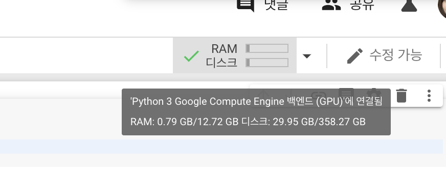

Colab은 구글이 제공하는 온라인 머신러닝 플랫폼입니다. 설치없이 온라인에서 쉽게 작업할 수 있고, 저의 컴퓨터보다 훨씬 좋은 성능에 GPU까지 제공해주고 있어서 사용하게 되었습니다. GPU를 제공해주지만 기본 설정은 CPU 사용으로 되어있기 때문에, GPU 사용을 원하면 설정을 해주어야 합니다.

## Colab GPU 사용 설정하기

노트를 열고, GPU 사용 가능 여부를 출력해보면 False라고 출력되는 것을 볼 수 있습니다. GPU 설정을 위해 상단의 **런타임** 탭을 눌러줍니다.

여기에서 **런타임 유형 변경**을 선택합니다.

하드웨어 가속기가 None으로 설정되어 있습니다. GPU를 선택하고 저장합니다.

우측 상단에서 GPU 환경에 연결된 것을 확인할 수 있습니다.
