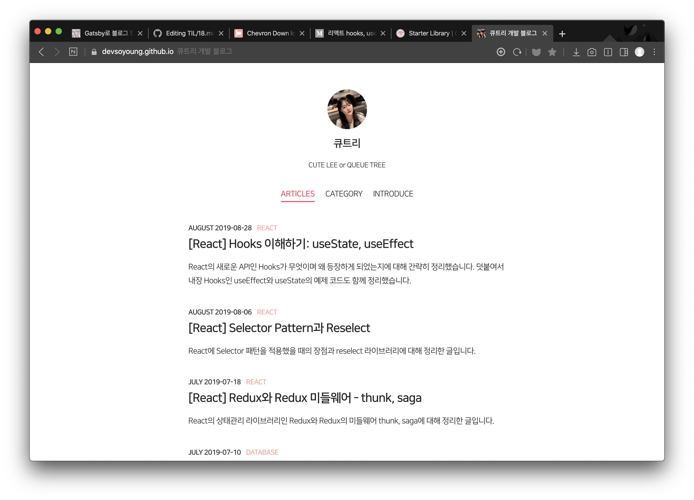
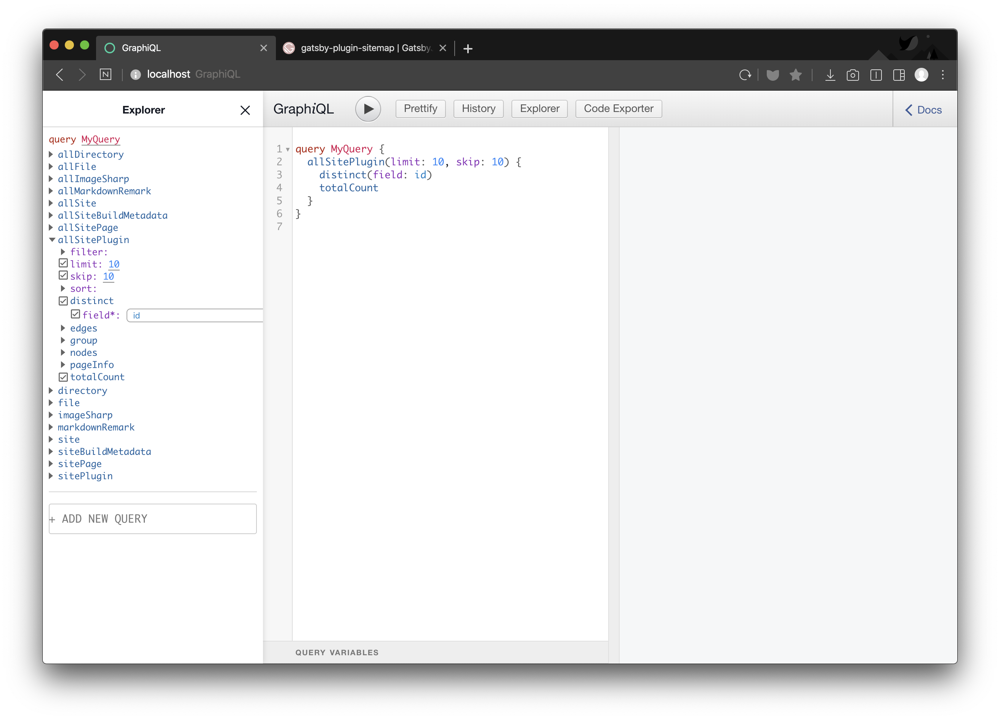

2020년 새해 목표 중 하나는 블로그를 새로 만드는 것이었습니다. ~~(또 다른 목표는 매달 블로그 글 하나씩 쓰기였는데..)~~ 지난 블로그도 Gatsby를 사용해서 만들었는데, 다른 개발자분이 만들어두신 스타터에 댓글을 추가하고 스타일만 수정해서 사용했습니다.  



한 번쯤은 직접 만들어 보고싶어서 새해 목표로 정했는데, 연초에는 인턴을 하느라 시간이 나지 않아 미루다 드디어 만들었습니다. 유용한 플러그인도 많고, 공식 문서에 설명도 잘 되어있어서 생각보다 금방 만들었습니다.


## 설치 및 시작하기
먼저 gatsby를 설치한 후, 새 프로젝트를 생성합니다.

```
$ npm install -g gatsby-cli
$ gatsby new gatsby-site
```

`gatsby-site` 디렉토리 안에 프로젝트가 생성됩니다.

> gatsby-cli를 설치하고 싶지 않다면 `npx gatsby new gatsby-site` 명령어를 실행하시면 됩니다.

`gatsby develop` 커맨드를 실행하면 `localhost:8000`에서 핫 리로드가 적용된 페이지를 확인할 수 있습니다.

## 마크다운 파일로 블로그 만들기
`gatsby-transformer-remark` [플러그인](https://www.gatsbyjs.org/docs/adding-markdown-pages/#transform-markdown-to-html-and-frontmatter-to-data-using-gatsby-transformer-remark)을 사용하면 마크다운 파일을 HTML로 변환할 수 있습니다. Gatsby는 공식문서가 진짜 잘 정리되어 있어서 필요한 플러그인을 검색하면 설치부터 적용까지 정리된 문서를 볼 수 있습니다.

### 📍 플러그인 설치
```
$ npm install --save gatsby-source-filesystem gatsby-transformer-remark
```

`gatsby-source-filesystem` 플러그인은 파일을 읽어옵니다. 플러그인을 사용하기 위해서는 `gatsby-config.js` 파일에 사용할 플러그인을 등록해야 합니다.

```js
// gatsby-config.js
plugins: [
  {
    resolve: "gatsby-source-filesystem",
    options: {
      name: "markdown-pages",
      path: `${__dirname}/src/markdown-pages`,
    },
  },
  "gatsby-markdown-remark"
]
```
`plugins` 배열에 사용할 플러그인의 이름과 설정을 추가합니다. 다른 option이 필요없다면 플러그인 이름만 문자열로 넣어도 등록할 수 있습니다. `options`의 `path`에는 파일이 들어있는 디렉토리를 지정합니다.

### 📍 마크다운 파일 만들기
마크다운 파일에는 `---`로 둘러싸인 블록 안에 정보를 추가할 수 있습니다. 이 정보는 `gatsby-markdown-remark`가 `frontmatter`로 파싱합니다. graphql 쿼리로 이 데이터를 컴포넌트에서 쉽게 가져다 쓸 수 있습니다.

```md
---
- date: "2019-10-20"
- title: "테스트용 게시글입니다."
- description: "게시글에 대한 설명입니다."
- template: "post"
- path: "/posts/test-post"
- draft: false

---

## 게시글
게시글 내용은 여기에 작성합니다.
``` 

블록 안의 데이터 key는 원하는대로 지정할 수 있습니다. 저는 date, title, description, template, path, draft를 사용했습니다. 이 값을 이용해서 데이터를 필터링해 가져오거나 정렬할 수 있습니다. 

### 📍 템플릿 만들기
```js
import React from "react"
import { graphql } from "gatsby"

export default function Template({ data }) {
  const { frontmatter, html } = data.markdownRemark;
  return (
    <div className="blog-post-container">
      <div className="blog-post">
        <h1>{frontmatter.title}</h1>
        <h2>{frontmatter.date}</h2>
        <div
          className="blog-post-content"
          dangerouslySetInnerHTML={{ __html: html }}
        />
      </div>
    </div>
  )
}

export const pageQuery = graphql`
  query($path: String!) {
    markdownRemark(frontmatter: { path: { eq: $path } }) {
      html
      frontmatter {
        date(formatString: "YYYY-MM-DD")
        path
        title
      }
    }
  }
`
```

`pageQuery`에서 정의한 graphql query 결과는 `Template` 컴포넌트에 `data`라는 이름의 `props`로 전달됩니다. 위 템플릿 예제는 공식 사이트 예제를 그대로 가져온 것인데, 블록 안의 데이터를 가져오고 싶다면 `pageQuery`의 `frontmatter`에 template, description 등의 필드를 추가하면 됩니다.

마크다운 파일의 내용은 html에 저장되고, `dangerouslySetInnerHTML`로 화면에 표시할 수 있습니다.

## 소스코드 하이라이팅
github는 아래와 같이 소스코드 블록 시작 기호 뒤에 언어를 표시하면 해당 언어의 문법에 맞게 예약어 등을 하이라이팅 해줍니다.

```
```js
```

`gatsby-remark-prismjs` [플러그인](https://www.gatsbyjs.org/packages/gatsby-remark-prismjs/)을 사용하면 HTML로 변환할 때, 소스코드를 예쁘게 만들어줍니다.

### 📍 플러그인 설치
```
$ npm install --save gatsby-remark-prismjs prismjs
```
플러그인과 `prismjs`를 설치한 후, `gatsby-config.js`에 설정을 추가해줍니다.

```js
// gatsby-config.js
plugins: [
  ...,
  {
    resolve: "gatsby-transformer-remark",
    options: {
     plugins: [
       "gatsby-remark-prismjs"
     ]
    }
  }
]
```

`gatsby-transformer-remark` 플러그인의 `options`안에 `gatsby-remark-prismjs`를 추가해줍니다. 플러그인의 플러그인..

### 📍 스타일 활성화
테마를 로드하기 위해서 `gatsby-browser.js`에 CSS 파일을 추가해줍니다.

```js
// gatsby-browser.js
require("prismjs/themes/prism-solarizedlight.css");
```
`themes` 뒤에 css 파일은 있는 테마 중에서 원하는 걸 사용하면 됩니다. 다 바꿔봤는데 저게 제일 예뻤어요.

> 라인 숫자, 언어 확장 등의 설정은 [도큐먼트](https://www.gatsbyjs.org/packages/gatsby-remark-prismjs/)를 참고해주세요 :)

## 마크다운 인라인 이미지
이미지 파일을 읽어와서 표시하는 기능은 `gatsby-remark-images`[(공식문서)](https://www.gatsbyjs.org/packages/gatsby-remark-images)를 사용했습니다.

### 📍 플러그인 설치

```
$ npm install --save gatsby-remark-images
```

> `gatsby-remark-images`를 사용하려면 `gatsby-plugin-sharp`도 필요한데, 이건 스타터에 포함되어 있어서 따로 설치하지 않았습니다.

```js
// gatsby-config.js
module.exports = {
  plugins: [
    `gatsby-plugin-sharp`,
    {
      resolve: `gatsby-transformer-remark`,
      options: {
        plugins: [
          {
            resolve: `gatsby-remark-images`,
            options: {
              maxWidth: 800,
            },
          },
        ],
      },
    },
    {
      resolve: `gatsby-source-filesystem`,
      options: {
        path: `${__dirname}/src/posts`,
      },
    },
  ],
}
```
`gatsby-transformer-remark` 안의 플러그인에 추가해줍니다. 썸네일을 알아서 만들어주고 Lazy Loading 까지 구현되어 있어서 플러그인만 설치하면 구현할 게 없었다는 사실..

## sitemap.xml 만들기
구글 검색결과에 노출되기 위해서 `sitemap.xml`을 만들어야하는데, 이것도 플러그인이 있어서 설정만 해주면 빌드할 때 깔끔하게 만들어줍니다.

### 📍 플러그인 설치
`gatsby-plugin-sitemap` [플러그인](https://www.gatsbyjs.org/packages/gatsby-plugin-sitemap/)을 설치합니다.

```
$ npm install --save gatsby-plugin-sitemap
```

`gatsby-config.js`의 `siteMetadata`에 `siteUrl` 필드를 추가하고, 사이트 주소를 넣어줍니다. 그리고 plugin에 추가합니다.

```js
// gatsby-config.js
{
  siteMetadata: {
    siteUrl: "https://www.example.com",
  },
  plugins: ["gatsby-plugin-sitemap"]
}
```

***
페이지마다 Title 설정하는 것도 `SEO` 컴포넌트가 이미 만들어져 있어서 전달하는 값만 변경하면 되었습니다. 스타터가 잘 만들어져있어서, 필요한 플러그인만 슥슥 갖다붙이면 되는 엄청난 편리함을 느꼈습니다. 



graphql을 한 번도 사용해 본 적이 없어서 처음에 많이 낯설었는데, 다른 쿼리를 보면서 따라하니까 금방 적응되었습니다. 그리고 개발 할 때 `localhost:8000/__graphql`로 접근하면 graphiQL로 더 쉽게 쿼리를 만들 수 있습니다.

블로그 제작 툴을 고민하고 있다면, Gatsby 추천드립니다. 👍🏻
