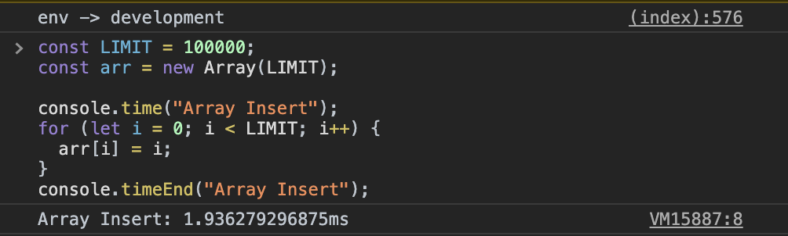

가끔 실행하는 코드가 얼마나 시간이 소요되는지, 혹은 어떤 코드가 더 빠른지 확인하고 싶을 때가 있습니다. `console.time`을 사용하면 실행시간을 쉽게 측정할 수 있습니다.

## [console.time](https://developer.mozilla.org/ko/docs/Web/API/Console/time)

```js
console.time("label");
```

파라미터로 전달하는 문자열 `label`은 타이머를 식별할 이름입니다. `console.timeEnd()`에 시간 측정을 종료할 타이머의 라벨을 전달하면 측정한 시간이 콘솔에 출력됩니다.

### 📍 Example

```js
const LIMIT = 100000;
const arr = new Array(LIMIT);

console.time("Array Insert");
for (let i = 0; i < LIMIT; i++) {
    arr[i] = i;
}
console.timeEnd("Array Insert");
```

위 코드는 길이가 LIMIT인 배열에 값을 설정하는 시간을 측정합니다. 측정할 구간의 시작과 끝을 각각 `console.time()`과 `console.timeEnd()`로 감싸고 파라미터로 동일한 이름을 전달하면 됩니다.



실행한 결과는 다음과 같이 `[label]: [시간]`으로 표시되기 때문에 의미를 갖는 라벨을 지정해주는 것이 좋습니다. 한 페이지에 최대 10,000개의 타이머를 지정할 수 있으니 여러 개의 타이머를 구분하려면 더더욱 이름을 잘 지어야겠죠.

`console.time`은 백그라운드에서 스크립트를 실행하는 [Web Worker](https://developer.mozilla.org/ko/docs/Web/API/Web_Workers_API)에서도 사용할 수 있습니다.
