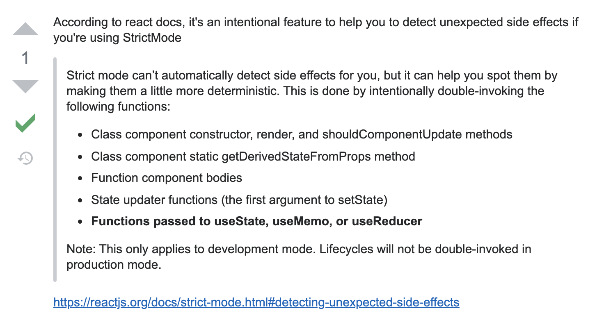

Jest 로 React 테스트 코드를 작성하는 튜토리얼을 따라하던 중이었습니다. 예제가 클래스형 컴포넌트로 되어있어서 함수형으로 변경하던 중, `console.log`로 찍으니 함수형 컴포넌트가 두 번 실행되는 것을 발견했습니다.

**_react useState render twice_** 라는 키워드로 검색해보니 관련된 글이 많이 나왔습니다. 저만 겪은 일은 아니었나봅니다. **create-react-app** 으로 생성하고 `useState`를 사용한 간단한 함수형 컴포넌트 하나만 만들었을 뿐인데, 왜 이런 문제가 발생했는지 너무 당황스럽습니다. 😂

> 결론부터 먼저 말씀드리면, 함수형 컴포넌트나 `useState`의 문제는 아닙니다. Strict Mode가 적용되어서 생긴 문제입니다.

문제의 코드는 마우스를 올렸을 때, 기존의 `NORMAL` 상태가 `HOVERED` 상태로 바뀌는 간단한 `Link` 컴포넌트입니다.

```jsx
import React, { useState } from "react";

const STATUS = {
    HOVERED: "hovered",
    NORMAL: "normal"
};
const classState = STATUS.HOVERED;

function Link({ children, url }) {
    const [classState, setClassState] = useState();
    console.log("classState: ", classState); // 💡 이 코드가 두 번 실행됩니다.

    function _onMouseEnter() {
        setClassState(STATUS.HOVERED);
    }

    function _onMouseLeave() {
        setClassState(STATUS.NORMAL);
    }

    return (
        <a
            className={classState}
            href={url || "#"}
            onMouseEnter={_onMouseEnter}
            onMouseLeave={_onMouseLeave}
        >
            {children}
        </a>
    );
}

export default Link;
```

클래스 상태를 출력하는 `console.log` 코드가 두 번 실행되는 것을 볼 수 있었습니다.

<br />

['useState() do double render'](https://stackoverflow.com/questions/54927622/usestate-do-double-render) 라는 글을 살펴보니 이유를 알 수 있었습니다.


React 문서에 따르면, 이렇게 두 번 호출되는 것은 버그가 아니라 **의도된 기능**이며, `StrictMode`에서 실행되는 이 기능은 사이드 이펙트를 발견할 수 있도록 도와줍니다.

## Strict Mode

[Strice Mode](https://ko.reactjs.org/docs/strict-mode.html#detecting-unexpected-side-effects)는 **애플리케이션 내의 잠재적인 문제를 알아내기 위한 도구**입니다. 이 모드는 개발모드에서만 활성화 되기 때문에, **프로덕션 빌드에는 영향을 끼치지 않습니다**.

이 모드를 처음 알았던 저는 Strict Mode가 설정되어 있다는 것도 알지 못했습니다. `create-react-app`으로 프로젝트를 생성하면 Strict Mode가 기본적으로 적용되어 있습니다. 이는 프로젝트의 시작 지점인 `index.js`에 가면 확인할 수 있습니다.

```js
// index.js
import React from "react";
import ReactDOM from "react-dom";
import "./index.css";
import App from "./App";
import * as serviceWorker from "./serviceWorker";

ReactDOM.render(
    <React.StrictMode>
        {" "}
        // 💡 바로 요기
        <App />
    </React.StrictMode>,
    document.getElementById("root")
);

// If you want your app to work offline and load faster, you can change
// unregister() to register() below. Note this comes with some pitfalls.
// Learn more about service workers: https://bit.ly/CRA-PWA
serviceWorker.unregister();
```

Strict Mode는 부작용을 감지할 수 있도록 다양한 기능을 제공합니다. 오늘 포스트에서는 다양한 기능 중 두 번 렌더링되는 이슈를 발생시켰던 **예상치 못한 부작용 검사** 챕터에 대해서 정리하겠습니다.

## [예상치 못한 부작용 검사](https://ko.reactjs.org/docs/strict-mode.html#detecting-unexpected-side-effects)

부작용이 어디에서 발생하는지 알기 위해서는 리액트가 동작하는 방식을 조금 더 자세히 알 필요가 있습니다. 리액트는 다음의 두 단계로 동작합니다.

-   **렌더링 단계** : 특정 환경에 어떤 변화가 필요한지 검사하는 단계
-   **커밋 단계** : 변경사항을 반영하는 단계

**렌더링 단계**는 `render` 함수를 호출해서 이전 렌더와 결과값을 비교합니다. **커밋 단계**는 React DOM의 경우, DOM 노드를 추가/변경하는 단계로, `componentDidMount`, `componentDidUpdate` 와 같은 생명주기 메서드를 실행합니다.

커밋 단계는 일반적으로 빠르지만, 렌더링 단계는 느릴 수 있습니다. 곧 추가될 `concurrent` 모드는 렌더링 작업을 더 작은 단위로 나누고, 작업을 중지했다 재개하는 방식으로 브라우저가 멈추는 것을 피합니다. _렌더링의 검사 과정이 60fps 보다 길어서 화면이 버벅거리는 느낌을 주는 것을 말하는 듯합니다._

이런 기능이 추가되면, React가 커밋을 하기 전에 렌더링 단계의 생명주기 메서드를 여러 번 호출하거나 아예 커밋을 하지 않을 수도 있습니다.

> 커밋을 하지 않는 경우는 에러 혹은 우선 순위에 의한 작업 중단 등이 있습니다.

### **렌더링 단계 생명주기 메서드**

-   `coustructor`
-   `componentWillMount` (or `UNSAFE_componentWillMount`)
-   `componentReceiveProps` (or `UNSAFE_componentReceiveProps`)
-   `componentWillUpdate` (or `UNSAFE_componentWillUpdate`)
-   `getDerivedStateFromProps`
-   `shouldComponentUpdate`
-   `render`
-   `setState` 업데이트 함수 (첫 번째 인자)

이 메서드들은 **여러 번 호출**될 가능성이 있기 때문에 주의⚠️가 필요합니다. 호출할 때마다 결과가 달라지는 '부작용'을 가지게 되면 원하지 않는 방식으로 애플리케이션이 동작할 수 있기 때문입니다. 함수 호출의 결과가 외부의 영향을 받지 않고 ✅ **입력값에 따라 결정되는 순수한 함수** 라면, 여러 번 호출되더라도 문제가 발생하지 않을 겁니다. (결과가 동일하다는 뜻입니다.)

Strict 모드가 자동적으로 부작용을 찾아주는 것은 불가능하지만, 문제가 될 함수를 두 번 실행하는 방법으로 발견을 도와줄 수 있습니다. 이게 바로 Strict Mode가 특정 함수를 두 번 실행하는(Double-Invoke) 이유입니다.

> 💡 두 번 실행했을 때 결과가 다르면, 부작용이 있다는 것을 알 수 있습니다.

### 이중 호출(Double-Invoke)되는 함수

-   클래스 컴포넌트의 `constructor`, `render` 그리고 `shouldComponentUpdate`
-   클래스 컴포넌트의 `getDrivedStateFromProps` static 메서드
-   함수 컴포넌트 바디
-   State updater 함수(`setState` 의 첫 번째 인자)
-   `useState`, `useMemo`, `useReducer` 에 전달되는 함수

아까 맨 처음에 작성했던 코드처럼 `useState`를 사용하면 **Strict Mode 가 해당 컴포넌트를 두 번 실행**하기 때문에, `console.log` 가 두 번 출력되는 결과를 낳았던 것입니다. `state`를 사용하지 않는 컴포넌트는 `console.log`의 결과가 한 번만 출력되는 것을 확인할 수 있었습니다.

[다른 글](https://dev.to/mccoyrjm/double-invoke-of-state-functions-in-react-5cl0)을 통해 Dan Abramov가 Github issue에 남긴 글을 찾을 수 있었습니다. 읽어보시면 조금 더 이해하는데 도움이 될 것 같습니다.

> "It is expected that setState updaters will run twice in strict mode in development. This helps ensure the code doesn't rely on them running a single time (which wouldn't be the case if an async render was aborted and alter restarted). If your setState updaters are pure functions (as they should be) then this shouldn't affect the logic of your application." - Dan Abramov [(source)](https://github.com/facebook/react/issues/12856#issuecomment-390206425)

만약 실행한 코드가 의도하지 않게 두 번 호출되는 상황을 발견했다면, Strict Mode가 적용된 것은 아닌지 살펴보세요. 그리고 내 코드에는 아무 문제가 없다는 것을 깨닫고 안심하시면 됩니다. 아무 짓도 안했는데 이상하게 동작해서 멘붕이 왔던 저의 경험이 누군가의 시간 낭비를 막을 수 있었으면 좋겠네요 🙏🏻
